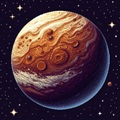
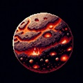
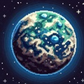

# GeoSimulator 🌍🪐


**GeoSimulator** is a Java desktop application for procedurally generating and simulating 2D planetary surfaces. With a focus on performance and scalability, GeoSimulator can effortlessly generate planets up to the size of Earth (40,000 km circumference) with no disk or memory storage for the world data — every chunk is generated on the fly!

---

## ✨ Features

- **Procedural Planet Generation** 🚀  
  Generate vast, unique planets using only a seed and circumference parameter. The same seed always produces the same planet, providing reproducible worlds.

- **Multiple Planet Types** 🌋🏜️🏝️❄️  
  Choose from several distinct planet biomes, each with unique visual styles:
  - 🪨 Rocky Planet
  - 🏜️ Desert Planet
  - 🌋 Volcanic Planet
  - 🌳 Garden Planet
  - ❄️ Icy Planet

- **Resource-Efficient Simulation** ⚡  
  - Each pixel represents **2 meters**.
  - Each "chunk" is 500x250 pixels (1 km window).
  - No world is saved to disk; everything is generated when needed.

- **Intuitive GUI** 🖱️  
  - Select planet type visually with icons.
  - Enter circumference (in kilometers) and a numeric seed.
  - One-click planet generation.

- **Reproducible Worlds** 🔁  
  - The same parameters always create the same planet terrain.

---

## 🖼️ Screenshots

<p align="center">
  
  
  
  
  
</p>

---

## 🚀 Getting Started

### Prerequisites

- ☕ Java 11 or higher (requires `java.desktop` module)
- 🖥️ Compatible with Windows, macOS, Linux

### Build & Run

1. **Clone the repository:**
   ```sh
   git clone https://github.com/kingddd04/GeoSimulator.git
   cd GeoSimulator
   ```

2. **Compile the source:**
   ```sh
   javac -d out src/scripts/*.java
   ```

3. **Run the application:**
   ```sh
   java -cp out scripts.Main
   ```

---

## 🕹️ Usage

1. On launch, select a planet type by clicking its icon.
2. Enter the planet's circumference in kilometers (e.g., 40000 for Earth).
3. Enter a numeric seed for world generation (any integer).
4. Click **Generate Planet!** to create and explore your new world.

> **Note:** The application does not save worlds to disk. Each session is uniquely generated based on your inputs.

---

## 📁 Project Structure

```
src/
  scripts/
    Main.java                # Entry point
    MainMenuGUI.java         # Main menu GUI
    PlanetGenerationManager.java # Core planet generation logic
    PlanetarySimulatorGUI.java   # 2D simulator panel
  sprites/                   # Planet & UI images
  module-info.java           # Java module definition
```

---

## 📏 Circumference & Seed Parameters

- **Circumference**: Defines planet size (in km). Each chunk/window is 1 km wide.
- **Seed**: Integer controlling world generation. The same seed & circumference yield the same world.

---

## 📄 License

MIT License  
© 2025 kingddd04

---

> **GeoSimulator** — Procedural, limitless worlds at your fingertips! 🚀🌌
