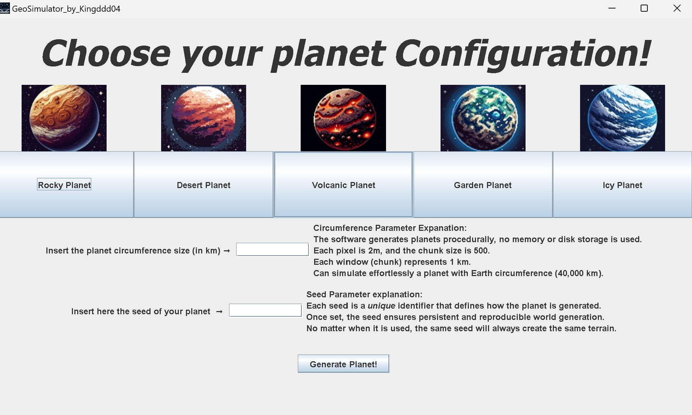
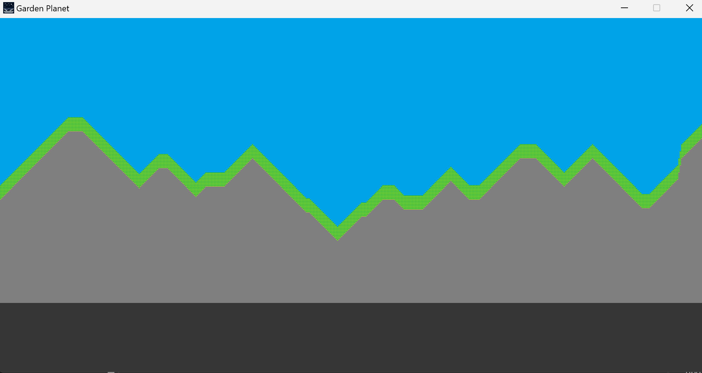
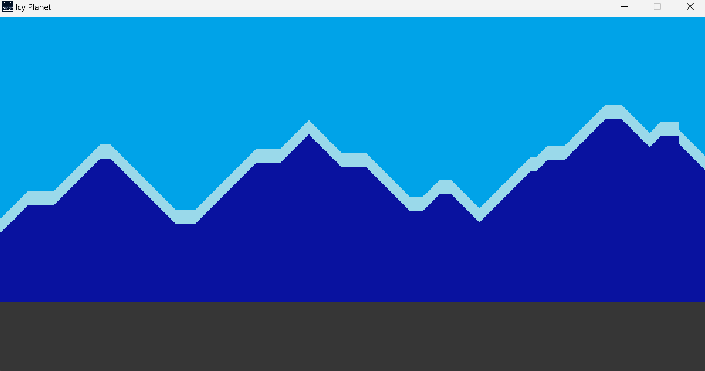

# GeoSimulator 🌍🪐

**GeoSimulator** is a Java desktop application for procedurally generating and simulating 2D planetary surfaces. With a focus on performance and scalability, GeoSimulator can effortlessly generate planets up to the size of Earth (40,000 km circumference) with no disk or memory storage for the world data — every chunk is generated on the fly!
The project is inspired to Simplerockets an old game by Jundroo, released around 2010 where you could build and launch rockets in a realistically sized solar system, i loved it. https://store.steampowered.com/app/343090/SimpleRockets/

---

## ✨ Features

- **Procedural Planet Generation** 🚀  
  Generate vast, unique planets using only a seed and circumference parameter. The same seed always produces the same planet, providing reproducible worlds.

- **Multiple Planet Types** 🌋🏜️🏝️❄️  
  Choose from several distinct planet biomes, each with unique visual styles:
  - 🪨 Rocky Planet
  - 🏜️ Desert Planet
  - 🌋 Volcanic Planet
  - 🌳 Garden Planet
  - ❄️ Icy Planet

- **Resource-Efficient Simulation** ⚡  
  - Each pixel represents **2 meters**.
  - Each "chunk" is 500x250 pixels (1 km window).
  - No world is saved to disk; everything is generated when needed.

- **Intuitive GUI** 🖱️  
  - Select planet type visually with icons.
  - Enter circumference (in kilometers) and a numeric seed.
  - One-click planet generation.

- **Reproducible Worlds** 🔁  
  - The same parameters always create the same planet terrain.

---

## 🖼️ Screenshots

  
  
  

---

## 🚀 Getting Started

### Prerequisites

- ☕ Java 11 or higher (requires `java.desktop` module)
- 🖥️ Compatible with Windows, macOS, Linux

### How to Run

- **Download source code:**
  Download the source code in a new java project and boot the "main" function.

- **Download your favourite executable file:**
  From releases you can download the exe file or the jar file.
  The exe can be executed direcly but the jar will need a compatible version installed
  

---

## 📏 Circumference & Seed Parameters

- **Circumference**: Defines planet size (in km). Each chunk/window is 1 km wide.
- **Seed**: Integer controlling world generation. The same seed & circumference yield the same world.

---

## 📄 License

MIT License  
© 2025 kingddd04

---
